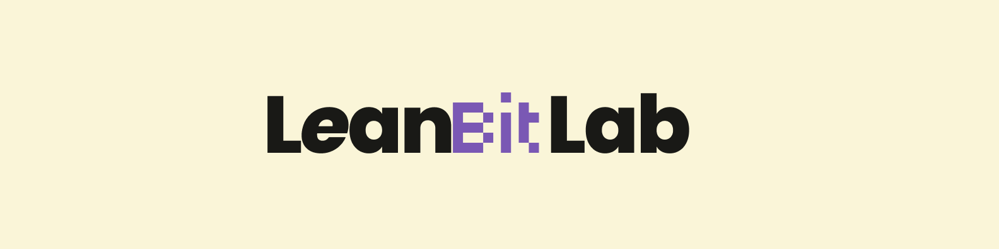
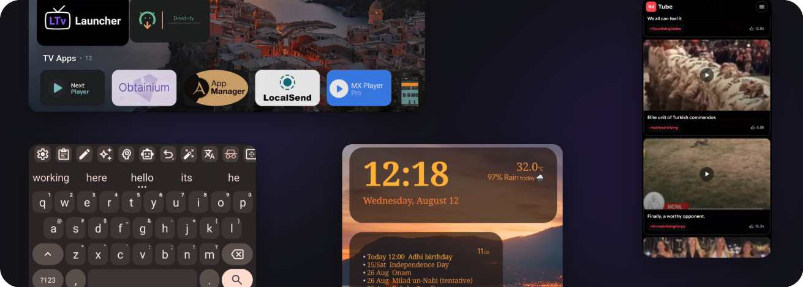

<!-- LeanBitLab GitHub Profile README -->

### Build lean. Build right.

**Crafting bloat-free, efficient Android and Linux experiences.**

  
  &nbsp;&nbsp;
  

<!-- GitHub Stats with combined stats from all repos -->

---

## 🚀 What We Build

We create open-source applications focused on **efficiency**, **privacy**, and **user experience**. We specialize in building bloat-free, high-performance software that respects device resources and delivers a premium user experience across Android and Linux environments.

 

  

---

## 📱 Android Projects

<table>
  <thead>
    <tr>
      <th width="32%" align="left">Project</th>
      <th width="43%" align="left">Description</th>
      <th width="25%" align="left">Stats &amp; Status</th>
    </tr>
  </thead>
  <tbody>
    <tr>
      <td><b><a href="https://github.com/LeanBitLab/LeanType">⌨️ LeanType</a></b></td>
      <td>AI-enhanced keyboard with custom providers &amp; dedicated keys</td>
      <td>
        
        
      </td>
    </tr>
    <tr>
      <td><b><a href="https://github.com/leanbitlab-org/LtvLauncher">📺 LTvLauncher</a></b></td>
      <td>Minimal TV launcher with WiFi widget &amp; OLED screensaver protection</td>
      <td>
        
        
      </td>
    </tr>
    <tr>
      <td><b><a href="https://github.com/LeanBitLab/Lwidget">📊 Lwidget</a></b></td>
      <td>Unified widget tracking time, calendar events, tasks, battery &amp; data usage</td>
      <td>
        
        
      </td>
    </tr>
    <tr>
      <td><b><a href="https://github.com/LeanBitLab/RdTube">🎬 RdTube</a></b></td>
      <td>Sleek, YouTube Shorts-style video browsing client for Reddit</td>
      <td>
        
        
      </td>
    </tr>
    <tr>
      <td><b><a href="https://github.com/LeanBitLab/Leantype-Handwriting-Plugin">✍️ Handwriting Plugin</a></b></td>
      <td>Handwriting recognition layout plugin for LeanType keyboard</td>
      <td>
        
        
      </td>
    </tr>
    <tr>
      <td><b><a href="https://github.com/LeanBitLab/Leantype-Translation-Plugin">🌐 Translation Plugin</a></b></td>
      <td>Google Translate layout plugin for LeanType keyboard</td>
      <td>
        
        
      </td>
    </tr>
    <tr>
      <td><b>📝 LeanBook</b></td>
      <td>Notes, Tasks, Reminders, Bills &amp; Shopping list</td>
      <td>
        
      </td>
    </tr>
    <tr>
      <td><b>📞 Minimal Dialer</b></td>
      <td>Clean, bloat-free phone dialer</td>
      <td>
        
      </td>
    </tr>
  </tbody>
</table>

---

## 💻 Other Projects

<table>
  <thead>
    <tr>
      <th width="32%" align="left">Project</th>
      <th width="43%" align="left">Description</th>
      <th width="25%" align="left">Stats &amp; Status</th>
    </tr>
  </thead>
  <tbody>
    <tr>
      <td><b><a href="https://github.com/LeanBitLab/adaptive-brightness-linux">💡 Adaptive Brightness Linux</a></b></td>
      <td>Backlight manager providing ambient-light adaptive brightness control for Linux displays</td>
      <td>
        
        
      </td>
    </tr>
  </tbody>
</table>

---

## 💡 Philosophy

> **"Everything you need. Nothing you don't."**

We build apps that are functional, efficient, and respect your resources — whether it's a simple utility or a complete productivity suite.

---

## ❤️ Support Us

Your support helps us maintain our current projects and develop new bloat-free experiences.

### 💖 GitHub Sponsors

Thank you to our amazing sponsors!

  <strong><a href="https://github.com/wshrguy">wshrguy</a></strong> &nbsp;&bull;&nbsp;
  <strong><a href="https://github.com/BeppeBoppo">BeppeBoppo</a></strong> &nbsp;&bull;&nbsp;
  <strong><a href="https://github.com/as3droid">as3droid</a></strong> &nbsp;&bull;&nbsp;
  <strong><a href="https://github.com/SRGWML">SRGWML</a></strong> &nbsp;&bull;&nbsp;
  <strong><a href="https://github.com/adven2rer">adven2rer</a></strong> &nbsp;&bull;&nbsp;
  <strong><a href="https://github.com/jimmietron">jimmietron</a></strong> &nbsp;&bull;&nbsp;
  <strong><a href="https://github.com/Redoregon">Redoregon</a></strong> &nbsp;&bull;&nbsp;
  <strong><a href="https://github.com/VinVel">VinVel</a></strong> &nbsp;&bull;&nbsp;
  <strong>Johan Marten</strong> &nbsp;&bull;&nbsp;
  <strong><a href="https://github.com/BareTread">BareTread</a></strong> &nbsp;&bull;&nbsp;
  <strong><a href="https://github.com/spielist">spielist</a></strong> &nbsp;&bull;&nbsp;
  <strong><a href="https://github.com/mtg92">mtg92</a></strong> &nbsp;&bull;&nbsp;
  <strong><a href="https://github.com/sergio-asenjo">sergio-asenjo</a></strong>

---

## 📫 Get In Touch

 
 

---

  <b>Open Source • Privacy Focused • Bloat Free</b>

